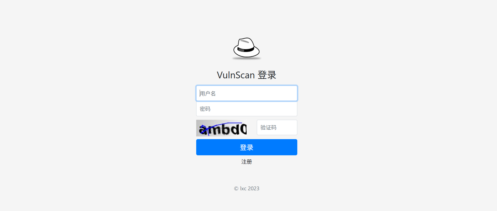
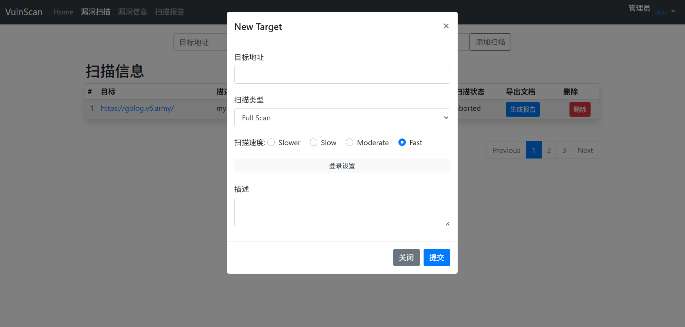
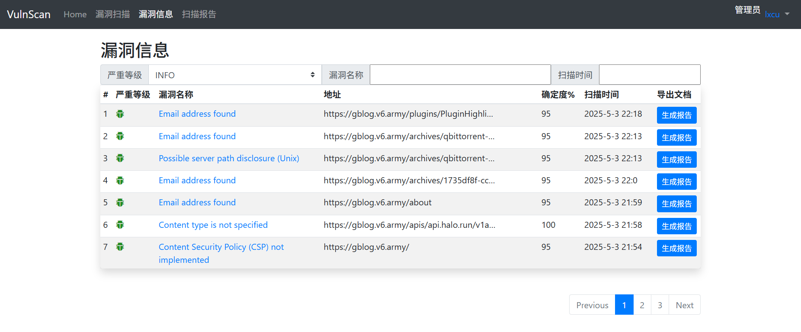
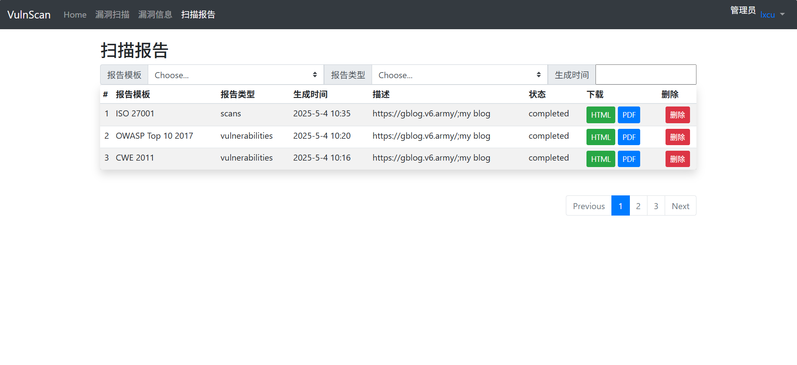
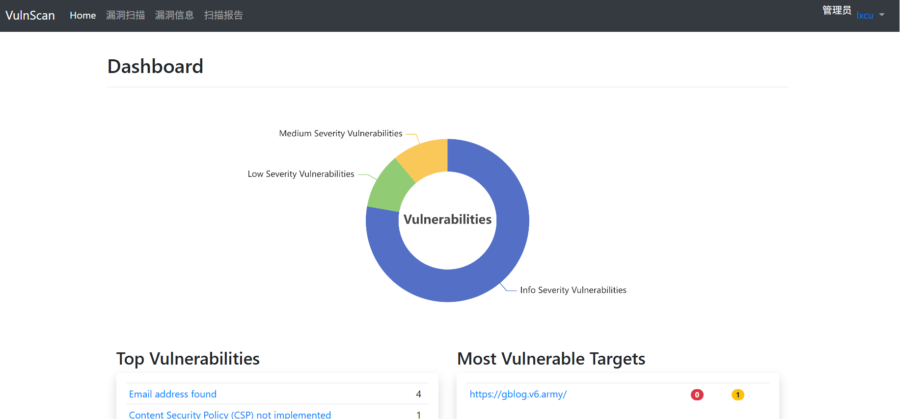

# VulnScan

## 前置安装

安装acunetix，获取APIKEY，将证书添加到java信任库

### **步骤 1：导出服务器证书**

可以使用浏览器访问该URL，然后导出证书

### **步骤 2：找到 Java 信任库路径**

* Java 默认信任库位于 `JAVA_HOME/lib/security/cacerts`。
* 可通过 `echo $JAVA_HOME` 或检查环境变量确认路径。

### **步骤 3：将证书导入信任库**

1. **执行 keytool 导入命令**：

    ```
    keytool -import -alias MyServerCert -keystore $JAVA_HOME/lib/security/cacerts -file server.crt
    ```

   * 默认密码：`changeit`
   * 出现提示时输入 `yes` 确认信任。

### **步骤 4：验证导入结果**

```
keytool -list -alias MyServerCert -keystore $JAVA_HOME/lib/security/cacerts
```

## 项目安装

1. 手动创建`.env`文件，示例

```
DB_USERNAME=vulnscan
DB_PASSWD=xxxx
DB_URL=jdbc:mysql://localhost:3306/vulnscan?useUnicode=true&characterEncoding=utf8&&serverTimezone=GMT%2b8
API_URL=https://desktop-jv0cb08:3443/api/v1/
API_KEY=1986ad8c0a5b3df4xxxxxxcxxxx8c66881d4
```

2. 手动创建数据库，手动运行`vulnscan.sql`文件创建数据库表
3. 注册用户后在数据库中手动修改用户`role`为`ADMIN`

## 技术架构

开发环境：Windows10操作系统，JAVA语言，JDK版本15，数据库MySQL，IDE工具为IDEA。

系统框架Spring Boot、Spring Security，持久层框架MyBatis-Plus，前端框架Bootstrap，通信技术WebSocket，验证码工具Kaptcha。

## 功能介绍

**登录注册功能**：通过Kaptcha、spring security实现验证码登录，密码加密，用户验证。



**目标扫描功能**：添加扫描目标地址，并设置扫描速度、扫描类型、登录设置（用户名密码登录、Cookie登录）等信息。添加扫描后利用WebSocket实时监测扫描状态，并将漏洞分布和扫描进度信息显示在前端页面。



**查看漏洞功能**：列表显示扫描出的全部漏洞。可查看单个扫描目标的漏洞或单个扫描目标的单个漏洞严重程度的漏洞信息。点击漏洞名称可查看漏洞详情。



**扫描报告和漏洞报告导出功能**：将扫描结果或漏洞信息导出为html或pdf文件。可选择导出的模板，如CWE 2011、OWASP Top 10 2017、ISO
27001等。



**信息统计功能**：对用户的扫描记录和扫描出的漏洞信息进行统计，使用Echarts插件显示图表信息。



**AWVS API相关功能**：通过RestTemplate向AWVS发送和获取数据，包括目标、扫描、漏洞、报告等相关API。

**WebSocket功能**：1.调用异步线程获取扫描状态信息。2.调用异步线程生成报告链接等信息，结束后返回状态信息。3.回复前端的心跳检测信息。

**数据校验功能**：对前端的数据进行JSR303数据校验，自定义枚举校验。

## 数据库设计

根据上述需求，我们可以设计如下数据库：

数据库名：vulnscan，字符集：utf8mb4，排序规则：utf8mb4_unicode_ci 

1. 用户表（users）：记录用户信息，包括用户名、密码、邮箱、角色等字段。
2. 扫描记录表（scan_record）：记录扫描记录信息，包括扫描类型、扫描网站地址、扫描时间、用户名等字段。
3. 漏洞信息表（vuln_info）：记录漏洞基本信息。
4. 漏洞报告表(scan_roport)：记录生成的扫描报告，漏洞报告。
